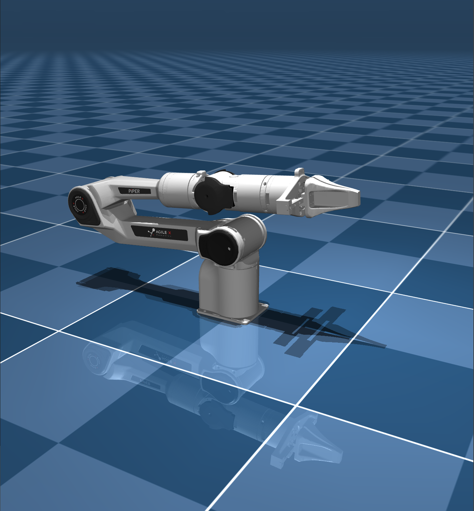
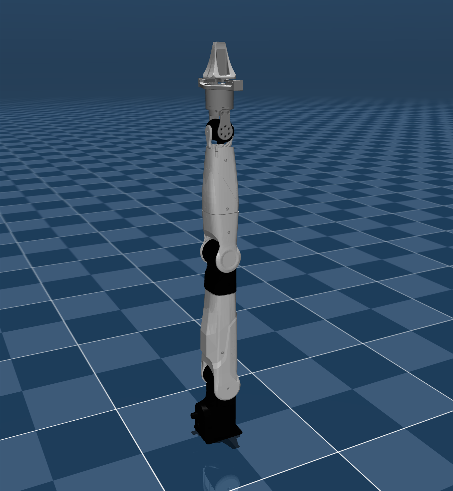
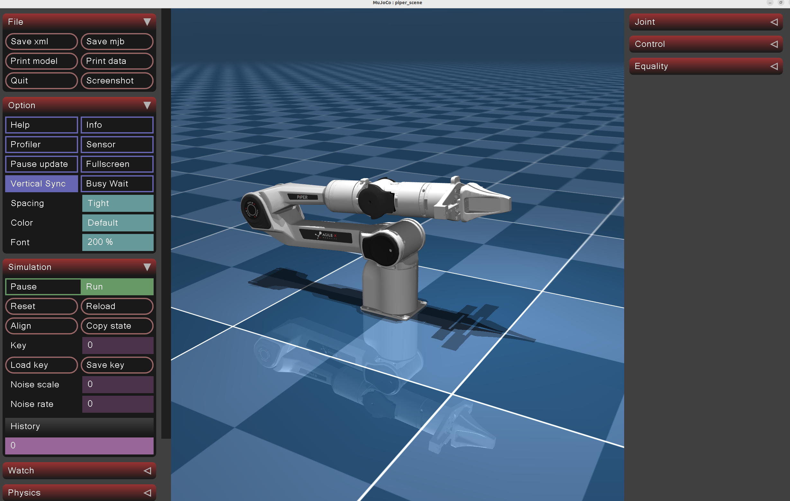
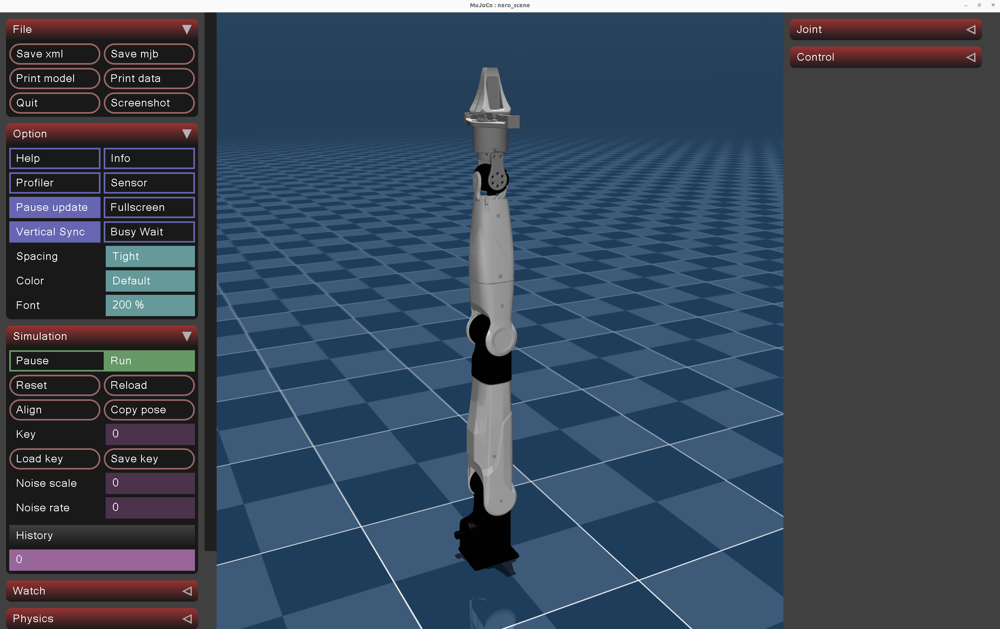

<div align="center">
  <h1>Agilex_Mujoco</h1>
  <table>
    <tr>
      <td align="center">
        <a href="https://global.agilex.ai/products/piper">
          
        </a>
        <br />
        <sub><strong>AgileX PiPER</strong></sub>
      </td>
      <td align="center">
        <a href="https://global.agilex.ai/products/nero">
          
        </a>
        <br />
        <sub><strong>AgileX NERO</strong></sub>
      </td>
    </tr>
  </table>
    <p>
      <a href="./readme.md"><kbd>中文</kbd></a>
      <strong><kbd>English</kbd></strong>
    </p>
</div>

# AgileX MuJoCo Simulation Base Description

This project provides the MuJoCo simulation base for the AgileX robotic arm series. 

# Quick Start
## Build agilex_arm_mujoco
```bash
git clone https://github.com/yanyuze1/agilex_arm_mujoco.git
cd agilex_arm_mujoco/simulate
mkdir build && cd build
cmake ..
make -j4
```

## ROS 2 Control Test Plugin

Modify `simulate/CMakeLists.txt`:
```bash
option(AGILEX_ENABLE_ROS2_CONTROL "Build ROS2 control plugin" OFF)
# Change to
option(AGILEX_ENABLE_ROS2_CONTROL "Build ROS2 control plugin" ON)
```

Then build:
```bash
git clone https://github.com/yanyuze1/agilex_ws.git
cd agilex_ws
colcon build --symlink-install --packages-up-to mujoco_ros2_control agilex_piper_mujoco
source install/setup.bash
cd agilex_mujoco/simulate
mkdir build && cd build
cmake ..
make -j4
```

## Run agilex_arm_mujoco
```bash
./agilex_mujoco -h
./agilex_mujoco -r piper -s scene.xml
./agilex_mujoco -r nero -s scene.xml
./agilex_mujoco -r piper -s piper_slope_demo.xml -p ros2_control
```

If the program runs successfully, it will launch a MuJoCo simulation environment and display the robotic arm inside the simulation.





# Module Testing Notes

When testing functional modules in the MuJoCo simulation environment, refer to the documentation: [Functional Module Testing Guide](https://my.feishu.cn/wiki/KINYwRU3fiqODOkH9NFcOem9nQe?fromScene=spaceOverview). You can also view the AgileX robotic arm series project repository here: [AgileX Robotic Arm Series](https://my.feishu.cn/wiki/FDdfwYpA9iDyUDkybMacw9HDnhg).

# References and Acknowledgements

- https://github.com/unitreerobotics/unitree_mujoco
